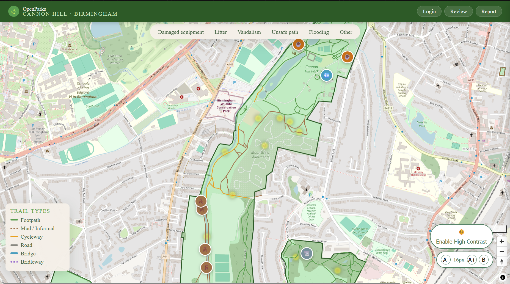
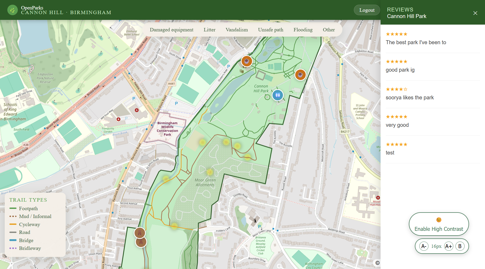
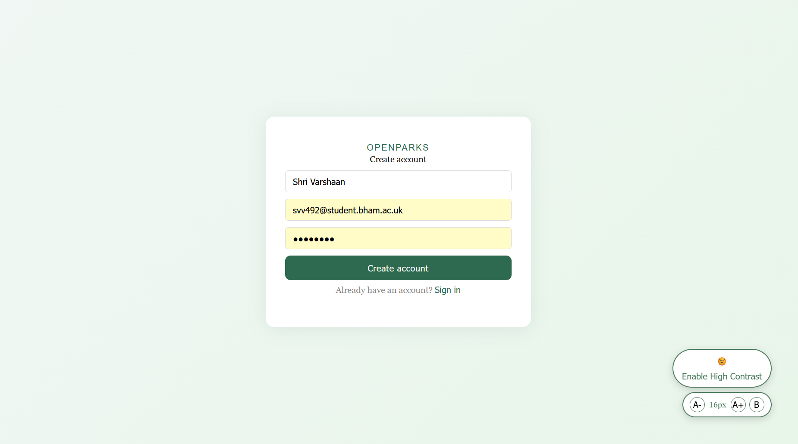
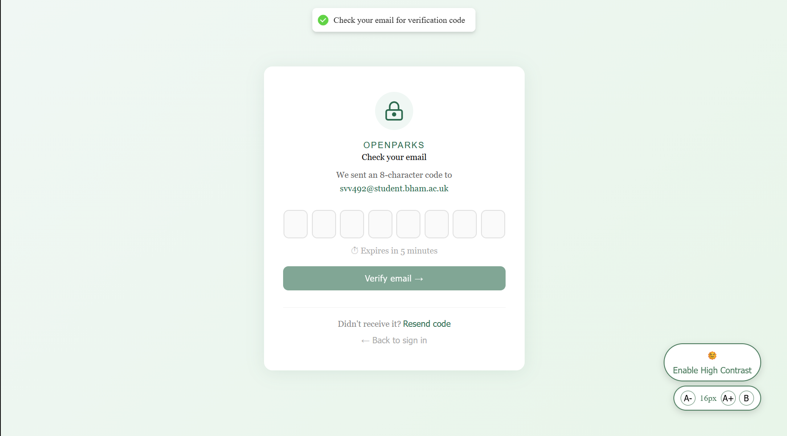
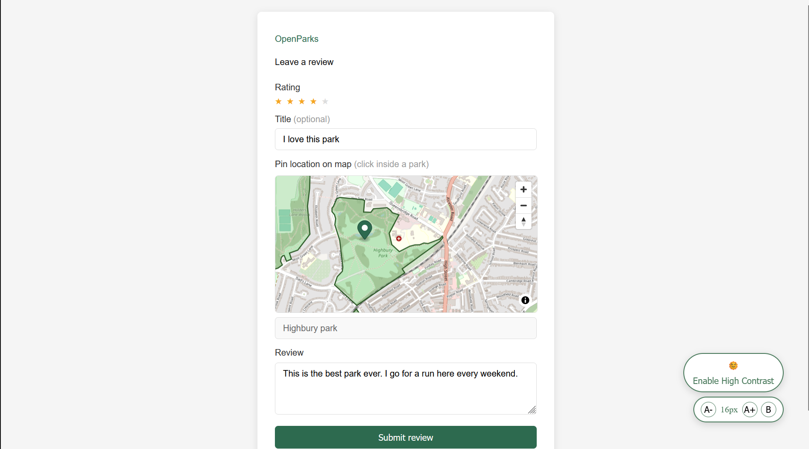
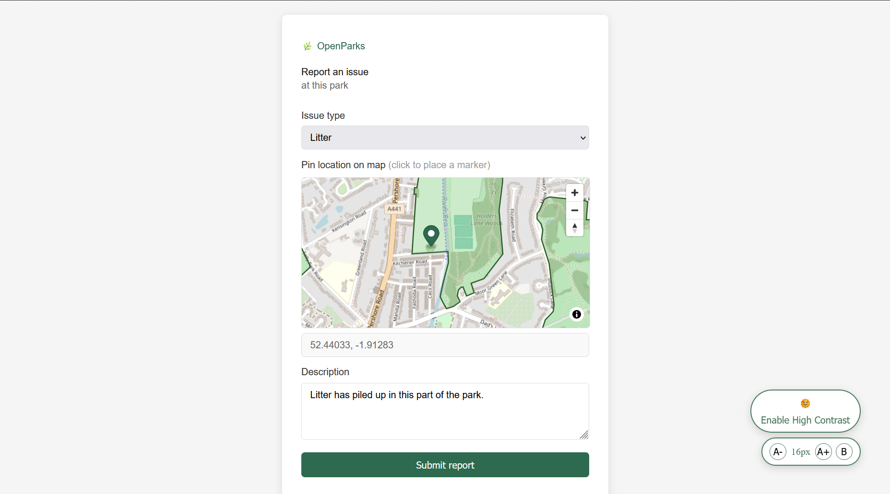
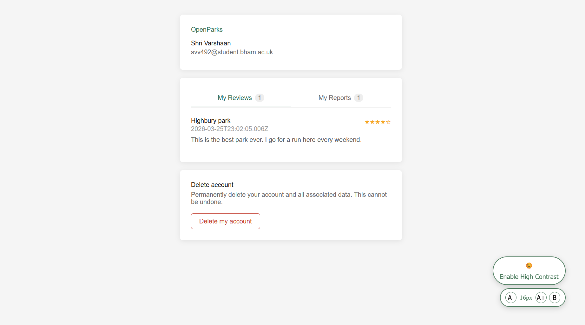

# OpenParks
 
A full-stack web application, built using the PERN stack (PostgreSQL, Express, Node.js and React) for discovering parks, submitting safety reports, leaving reviews, and managing trails and amenities.
 
---

> Note the website will not work in its current state as there are no env files. I will work on hosting this app soon and also uploading a .sql file so it can be run locally

## Using the website

### Main page

On the main page of the site, is a map of the parks along with trail and amenity information. Clicking on any of the parks open a side pane with all the reviews associated with the park. Clicking on the toolbar on top shows all the report/hazard markers associated with the parks.

Zooming into a park will display all the amenities associated with it and zooming out will remove those details from the park. The parks also have a heatmap of the reports created in them.





### Login page

Login/signup to the app



> Check your spam folder, if an email with your otp is not in your inbox



### Reviews page

> Note: you'll have to login to access this page

In the reviews page, simply click on any park you want to leave a review for and leave your rating.



### Reports page

> Note: you'll have to login to access this page

In the reports page, simple click on the location in the map, to report a hazard.



### Account page

> Note: you'll have to login to access this page

In the accounts page you'll have access to all the reports you've filed and the reviews you've left. Additionally, you'll have the option to delete your openparks account and all associated data



---
 
## 🚀 Getting Started
 
### Prerequisites
 
- [Node.js](https://nodejs.org/) (v18 or higher recommended)
- [npm](https://www.npmjs.com/)
 
---
 
### Backend Setup

> Note: Use a separate terminal to run the frontend and the backend
 
```bash
# Navigate to the backend directory
cd backend
 
# Install dependencies
npm install

#cd into the src folder
cd src
 
# Start the server
node server.js
```
 
The backend will start on **http://localhost:3000**
 
---
 
### Frontend Setup
 
```bash
# Navigate to the frontend directory
cd frontend
 
# Install dependencies
npm install
 
# Start the development server
npm run dev
```
 
The frontend will be available on **http://localhost:5173** (or **http://localhost:5174**)
 
---
 
## 🗺️ Frontend Pages
 
| Page | Path | Description |
|---|---|---|
| Home | `/` | Browse and discover parks |
| Report | `/report` | Submit a safety report for a park |
| Login | `/login` | User login/signup |
| Review | `/review` | Leave a review for a park |
| Account | `/account` | View and manage your account |
 
---
 
## API Endpoints
 
| Resource | Base Path | Description |
|---|---|---|
| Parks | `/api/parks` | get all park listings |
| Auth | `/api/auth` | User authentication login/signup and OTP's |
| Amenities | `/api/amenities` | Manage park amenities |
| Safety Reports | `/api/safetyreport` | Submit and retrieve safety reports |
| Reviews | `/api/reviews` | Post and fetch park reviews |
| Trails | `/api/trails` | Manage trail information for parks |
| User / Account | `/api/user` | Account management and user profile |
 
---
 
## Tech Stack
 
| Layer | Technology |
|---|---|
| Frontend | React |
| Backend | Node.js, Express |
| Database ORM | Prisma |
| Database | PostgreSQL with PostGIS |
| Database hosting | Supabase |
| Auth | Passport.js |
| API's | Maplibre gl js|
| Testing | Jest |

All of the data related to park boundaries, trails and amenities were sourced from the overpass API and stored in the database

---
 
## CORS
 
The API is configured to accept requests from:
- `http://localhost:5173`
- `http://localhost:5174`

---

## Testing

### Backend

The test plan for the backend of the app is in the `backend/tests` directory. The test plan also contains instructions on how to run the tests.

### Frontend

The test plan for the frontend of the app is in `frontend/`. The test plan also contains instructions on how to run the tests.

---
