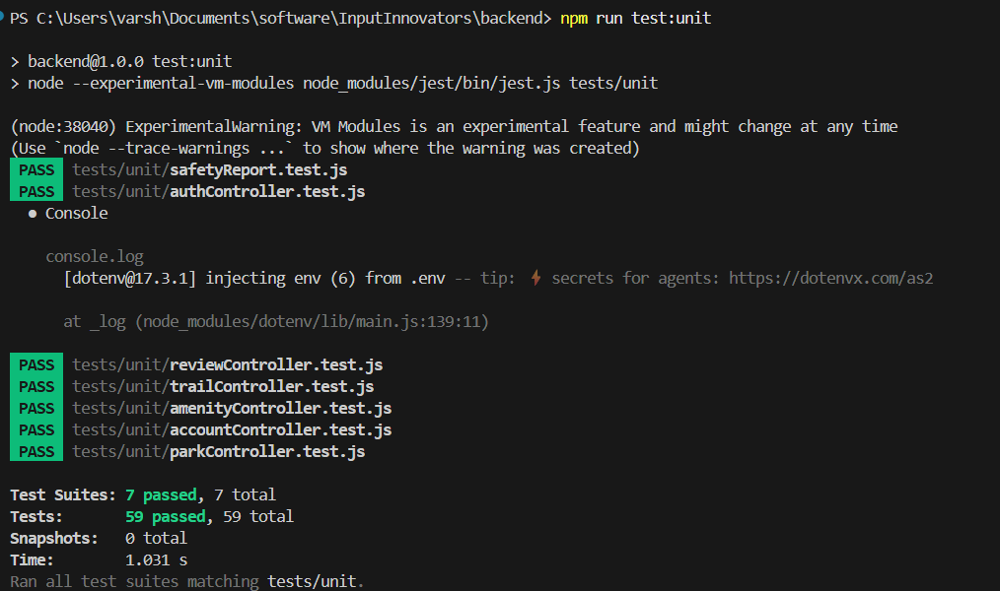
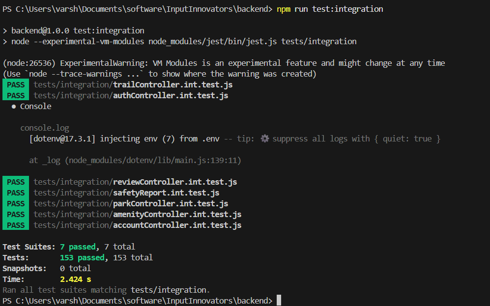

# Test Plan: Parks Web Application
## Unit & Integration Testing

| | |
|---|---|
| **Project** | OpenParks web app |
| **Backend Framework** | Nodejs, Express, Prisma (ORM) |
| **Test Framework** | Jest  |
| **Status** | All Tests Passing |

---

## 1. Introduction & Objectives

This document defines the Test Plan for the OpenParks backend API. The application provides REST endpoints for managing parks, user authentication, amenities, reviews, and safety reports. Data persistence is handled by Prisma ORM to a PostgreSQL database with PostGIS hosted on Supabase

The testing strategy is divided into two phases:

1. **Unit Testing:** each controller is tested in complete isolation by mocking all external dependencies (Prisma, bcrypt, JWT, nodemailer).
2. **Integration Testing:** after all the features are developed, the system is tested end-to-end using a real database.

Test objectives include:

- Verify each API endpoint returns correct HTTP status codes and response bodies.
- Ensure authentication, authorisation, CRUD, error handling work as intended.
- Confirm error paths (404 Not Found, 401 Unauthorised, 403 Forbidden, 409 Conflict, 500 Server Error) behave as specified.
- Validate that integration of auth middleware, database layer, and controllers produces consistent behaviour.

---

## 2. Scope

### 2.1 Modules Under Test

| Controller | Source File | Responsibility |
|---|---|---|
| authController | src/controllers/authController.js | User signup, login, JWT issuance |
| parkController | src/controllers/parkController.js | GeoJSON FeatureCollection retrieval, park lookup by ID |
| amenityController | src/controllers/amenityController.js | Retrieve amenities for a given park |
| reviewController | src/controllers/reviewController.js | CRUD for park reviews, authorisation checks |
| safetyReportController | src/controllers/safetyReport.js | Create/retrieve/update safety reports with spatial data |
| trailController | src/controllers/trailController.js | Retrieve trails |
| accountController | src/controllers/accountController.js | retrieve/delete user and associated details |

### 2.2 Out of Scope

- Third-party email provider reliability (nodemailer / sendVerification is mocked).
- Database migration scripts and Prisma schema validation.

---

## 3. Test Environment & Tooling

| Item | Detail |
|---|---|
| **Runtime** | Node.js (ESM support required) |
| **Test Runner** | Jest `--experimental-vm-modules` flag |
| **Mocking Strategy** | `jest.unstable_mockModule()` for ESM-compatible module replacement |
| **ORM (mocked)** | Prisma database calls replaced with `jest.fn()` mocks |
| **Auth (mocked)** | bcrypt (`hash` / `compare`) and jsonwebtoken (`sign`) both mocked |
| **Email (mocked)** | `nodemailer.createTransport().sendMail` — mocked, never sends real mail |
| **Integration DB** | PostgreSQL 15 + PostGIS 3 (Docker container seeded with fixture data) |

---

## 4. Unit Tests

Each controller is tested in complete isolation. Database, crypto, JWT, and email dependencies are replaced with Jest mock functions. The `res` object is a minimal stub with chained `status()` and `json()` methods. Tests assert both the mock calls made (interaction testing) and the response sent (state testing).

---

### 4.1 authController

**File:** `tests/unit/authController.test.js`

#### 4.1.1 `signup()`

| Test ID | Description | Input / Setup | Expected Result | Actual Result | Status |
|---|---|---|---|---|---|
| UT-AU-01 | Returns 409 if user already exists | `email: test@example.com`, `findUnique` returns existing user | `status 409`, body: `{ message: 'User exists already' }` | status 409 | PASS |
| UT-AU-02 | Creates new user and returns JWT | Valid email/password/username, `findUnique` returns null | `status 201`, body includes `token` and `user {id, email}` | status 201 with `fake-jwt-token` | PASS |
| UT-AU-03 | Returns 500 if signup throws | `findUnique` rejects with DB error | `status 500`, body: `{ message: 'Sign up unsuccessful' }` | status 500 | PASS |

#### 4.1.2 `login()`

| Test ID | Description | Input / Setup | Expected Result | Actual Result | Status |
|---|---|---|---|---|---|
| UT-AU-04 | Returns 401 if user not found | `findUnique` returns null | `status 401`, body: `{ message: 'Invalid credentials' }` | status 401 | PASS |
| UT-AU-05 | Returns 401 if password is wrong | `bcrypt.compare` returns false | `status 401`, body: `{ message: 'Invalid credentials' }` | status 401 | PASS |
| UT-AU-06 | Logs in and returns JWT on valid credentials | User found, `bcrypt.compare` returns true | `status 200`, body includes `token` and `user {id, email}` | status 200 with `login-token` | PASS |
| UT-AU-07 | Returns 401 if login throws | `findUnique` rejects with DB failure | `status 401`, body: `{ message: 'Invalid credentials' }` | status 401 | PASS |

---

### 4.2 parkController

**File:** `tests/unit/parkController.test.js`

#### 4.2.1 `getAllParks()`

| Test ID | Description | Input / Setup | Expected Result | Actual Result | Status |
|---|---|---|---|---|---|
| UT-PK-01 | Returns all parks as GeoJSON FeatureCollection | `$queryRaw` returns array of 2 parks with geometry | `status 200`, `type: FeatureCollection`, features array length 2 | status 200, correct FeatureCollection | PASS |
| UT-PK-02 | Returns 500 if DB query fails | `$queryRaw` rejects with DB failure | `status 500`, body: `{ error: 'Failed to fetch parks' }` | status 500 | PASS |

#### 4.2.2 `getParkById()`

| Test ID | Description | Input / Setup | Expected Result | Actual Result | Status |
|---|---|---|---|---|---|
| UT-PK-03 | Returns single park as GeoJSON Feature | `parkId: 1`, `$queryRaw` returns one park row | `status 200`, `type: Feature` with correct geometry and properties | status 200, correct Feature | PASS |
| UT-PK-04 | Returns 404 if park not found | `$queryRaw` returns empty array | `status 404`, body: `{ error: 'Park not found' }` | status 404 | PASS |
| UT-PK-05 | Returns 500 on query failure | `$queryRaw` rejects | `status 500`, body: `{ error: 'Failed to fetch park' }` | status 500 | PASS |

---

### 4.3 amenityController

**File:** `tests/unit/amenityController.test.js`

#### 4.3.1 `getAmenities()`

| Test ID | Description | Input / Setup | Expected Result | Actual Result | Status |
|---|---|---|---|---|---|
| UT-AM-01 | Returns amenities for a valid park | `parkId: 1`, `findMany` returns 2 amenities | `status 200`, body: array of 2 amenity objects, `findMany` called with `{ where: { park_id: 1 } }` | status 200 with amenities array | PASS |
| UT-AM-02 | Returns empty list if no amenities | `parkId: 2`, `findMany` returns `[]` | `status 200`, body: `[]` | status 200 with empty array | PASS |
| UT-AM-03 | Returns 500 on query failure | `findMany` rejects with DB error | `status 500`, body: `{message: "Internal server error"}` | status 500 | PASS

#### 4.3.2 `getAllAmenities()`

| Test ID | Description | Input / Setup | Expected Result | Actual Result | Status |
|---|---|---|---|---|---|
| UT-AM-04 | Returns GeoJSON FeatureCollection for all amenities | `queryRaw` returns 2 amenity rows with `lng`/`lat` fields | `status 200`, body: array of 2 GeoJSON Feature objects with `type`, `geometry`, and `properties` | status 200 with GeoJSON array | PASS |
| UT-AM-05 | Returns empty array when no amenities exist | `queryRaw` returns `[]` | `status 200`, body: `[]` | status 200 with empty array | PASS |
| UT-AM-06 | Returns 500 on database query failure | `queryRaw` rejects with DB error | `status 500`, body: `{ message: "Internal server error" }` | status 500 | PASS |

---

### 4.4 reviewController

**File:** `tests/unit/reviewController.test.js`

#### 4.4.1 `getAllReviewsPark()`

| Test ID | Description | Input / Setup | Expected Result | Actual Result | Status |
|---|---|---|---|---|---|
| UT-RV-01 | Returns all reviews for a park | `parkId: 1`, `findMany` resolves with 1 review | `status 200`, body: `[review]`, `findMany` called with `{ where: { park_id: 1 } }` | status 200 with expected body| PASS |
| UT-RV-02 | Returns 500 on database query failure | `findMany` rejects with DB error` | `status 500`, body: `{message: "Internal server error"}` | status 500 | PASS

#### 4.4.2 `addReviewPark()`

| Test ID | Description | Input / Setup | Expected Result | Actual Result | Status |
|---|---|---|---|---|---|
| UT-RV-03 | Returns 404 if park does not exist | `findUnique` returns null for park | `status 404`, body: `{ message: 'Park not found' }` | status 404 | PASS |
| UT-RV-04 | Creates review for valid park | Park found, `create` resolves with new review | `status 201`, body: created review object | status 201 with review data | PASS |
| UT-RV-05 | Returns 500 on database query failure | `create` rejects with DB error | `status 500`, body: `{mrssage: "Internal server error"}` | status 500 | PASS |

#### 4.4.3 `getAllReviewsUser()`

| Test ID | Description | Input / Setup | Expected Result | Actual Result | Status |
|---|---|---|---|---|---|
| UT-RV-06 | Returns all reviews for logged-in user | `user.id: 10`, `findMany` returns 1 review | `status 200`, body: `[review]`, includes park name select | status 200 | PASS |
| UT-RV-07 | Returns 500 on database query failure | `findMany` rejects with DB error` | `status 500`, body: `{message: "Internal server error"}` | status 500 | PASS

#### 4.4.4 `getReviewById()`

| Test ID | Description | Input / Setup | Expected Result | Actual Result | Status |
|---|---|---|---|---|---|
| UT-RV-08 | Returns 404 if review not found | `id: 99`, `findUnique` returns null | `status 404`, body: `{ message: 'Unavailable' }` | status 404 |  PASS |
| UT-RV-09 | Returns review if found | `id: 1`, `findUnique` returns review | `status 200`, body: review object | status 200 | PASS |
| UT-RV-10 | Returns 500 on database query failure | `findUnique` rejects with DB error` | `status 500`, body: `{message: "Internal server error"}` | status 500 | PASS

#### 4.4.5 `updateReview()`

| Test ID | Description | Input / Setup | Expected Result | Actual Result | Status |
|---|---|---|---|---|---|
| UT-RV-11 | Returns 403 if user not owner | `findUnique` returns null (no matching review + user) | `status 403`, body: `{ message: 'unauthorized' }` | status 403 | PASS |
| UT-RV-12 | Updates review when user is owner | `findUnique` returns review with `user_id: 10`, `update` resolves | `status 200`, body: `{ message: 'Updated successfully' }` | status 200 | PASS |
| UT-RV-13 | Returns 500 on database query failure | `findUnique` rejects with DB error` | `status 500`, body: `{message: "Internal server error"}` | status 500 | PASS

#### 4.4.6 `deleteReview()`

| Test ID | Description | Input / Setup | Expected Result | Actual Result | Status |
|---|---|---|---|---|---|
| UT-RV-14 | Returns 403 if user not owner | `findUnique` returns null | `status 403`, body: `{ message: 'unauthorized' }` | status 403 | PASS |
| UT-RV-15 | Deletes review when user is owner | `findUnique` returns review with matching `user_id` | `status 204` | status 204  | PASS |
| UT-RV-16 | Returns 500 on database query failure | `findUnique` rejects with DB error` | `status 500`, body: `{message: "Internal server error"}` | status 500 | PASS
---

### 4.5 safetyReportController

**File:** `tests/unit/safetyReport.test.js`

#### 4.5.1 `getAllReports()`

| Test ID | Description | Input / Setup | Expected Result | Actual Result | Status |
|---|---|---|---|---|---|
| UT-SR-01 | Returns all safety reports for a park | `$queryRaw` returns array of 1 report | `status 200`, body: `[report]`, `$queryRaw` called once | status 200 | PASS |
| UT-SR-02 | Returns 500 on database query failure | `queryRaw` rejects with DB error` | `status 500`, body: `{message: "Internal server error"}` | status 500 | PASS

#### 4.5.2 `createNewReport()`

| Test ID | Description | Input / Setup | Expected Result | Actual Result | Status |
|---|---|---|---|---|---|
| UT-SR-03 | Creates a new safety report with PostGIS geometry | Valid body with coordinates, `user.id: 5`, `$executeRaw` resolves | `status 201`, body: created report object | status 201  | PASS |
| UT-SR-04 | Returns 500 if creation fails | `$executeRaw` rejects with DB failure | `status 500`, body: `{ error: 'Internal server error' }` | status 500 | PASS |

#### 4.5.3 `updateReport()`

| Test ID | Description | Input / Setup | Expected Result | Actual Result | Status |
|---|---|---|---|---|---|
| UT-SR-05 | Returns 404 if report not found | `findUnique` returns null | `status 404`, body: `{ message: 'report not found' }` | status 404 | PASS |
| UT-SR-06 | Updates report status successfully | `findUnique` returns report, `update` resolves | `status 200`, body: updated report object | status 200 | PASS |
| UT-SR-07 | Returns 400 for Prisma P2002 constraint error | `update` rejects with `error.code P2002` | `status 400`, body: `{ error: 'Invalid error code' }` | status 400  | PASS |
| UT-SR-08 | Returns 500 for unknown update errors | `update` rejects with generic Error | `status 500`, body: `{ error: 'Server error' }` | status 500 |  PASS |

#### 4.5.4 `getUserReports()`

| Test ID | Description | Input / Setup | Expected Result | Actual Result | Status |
|---|---|---|---|---|---|
| UT-SR-09 | Returns reports for a valid user with parks | `findMany` returns array of 2 reports with `Park` relation | `status 200`, body: reports body | status 200 | PASS |
| UT-SR-10 | Returns empty array when user has no reports | `findMany` returns `[]` | `status 200`, body: `[]` | status 200 | PASS |
| UT-SR-11 | Returns 500 on database query failure | `findMany` rejects with DB error | `status 500`, body: `{message: "Internal server error"}` | status 500 | PASS |
---

### 4.6 accountController

**File:** `tests/unit/accountController.test.js`

#### 4.6.1 `getUser()`

| Test ID | Description | Input / Setup | Expected Result | Actual Result | Status |
|---|---|---|---|---|---|
| UT-AC-01 | Returns user when found | `findUnique` returns user body | `status 200`, body: user body | status 200 | PASS |
| UT-AC-02 | Returns 404 when user is not found | `findUnique` returns `null` | `status 404`, body: `{message: "User not found"}` | status 404 | PASS |
| UT-AC-03 | Returns 500 on database error in getUser | `findUnique` rejects with DB error | `status 500`, body: error object | status 500 | PASS |

#### 4.6.2 `deleteUser()`

| Test ID | Description | Input / Setup | Expected Result | Actual Result | Status |
|---|---|---|---|---|---|
| UT-AC-04 | Returns 200 with confirmation on account deletion | `delete` resolves successfully | `status 200`, body: `{message: "Account deleted"}` | status 200 | PASS |
| UT-AC-05 | Returns 500 on database error in deleteUser | `delete` rejects with DB error | `status 500`, body: error object | status 500 | PASS |
---

### 4.7 trailController

**File:** `tests/unit/accountController.test.js`

#### 4.7.1 `getTrailsByParkId()`

| Test ID | Description | Input / Setup | Expected Result | Actual Result | Status |
|---|---|---|---|---|---|
| UT-TC-01 | Returns FeatureCollection for a valid park id | `$queryRaw` returns array of 2 trail rows | `status 200`, body: trail body | status 200 | PASS |
| UT-TC-02 | Returns empty FeatureCollection when no trails exist for park | `$queryRaw` returns `[]` | `status 200`, body: `{type: "FeatureCollection", features: []}` | status 200 | PASS |
| UT-TC-03 | Returns 500 on database error in getTrailsByParkId | `$queryRaw` rejects with DB error | `status 500`, body: `{error: "Failed to fetch trails"}` | status 500 | PASS |

#### 4.7.2 `getAllTrails()`

| Test ID | Description | Input / Setup | Expected Result | Actual Result | Status |
|---|---|---|---|---|---|
| UT-TC-04 | Returns FeatureCollection of all trails | `$queryRaw` returns array of 2 trail rows | `status 200`, body: trail body | status 200 | PASS |
| UT-TC-05 | Returns empty FeatureCollection when no trails exist | `$queryRaw` returns `[]` | `status 200`, body: `{type: "FeatureCollection", features: []}` | status 200 | PASS |
| UT-TC-06 | Returns 500 on database error in getAllTrails | `$queryRaw` rejects with DB error | `status 500`, body: `{error: "Failed to fetch trails"}` | status 500 | PASS |
---

## 5. Integration Tests

Integration tests run against the full Express application stack including authentication middleware, Prisma ORM, and a seeded PostgreSQL/PostGIS database. Supertest is used to make HTTP requests without binding a real port. Tests are ordered to reflect realistic user journeys.

---

### 5.1 Authentication Flow

**File:** `tests/unit/authController.int.test.js`

#### 5.1.1 `signup()`

| ID | Scenario | Modules | Steps | Expected | Actual Result | Status |
|---|---|---|---|---|---|---|
| UT-AU-01 | `signup` returns 409 when email is already registered | authController, Prisma | Mock `prisma.user.findUnique` to resolve with `mockExistingUser`; call `signup` with `signupBody` | Response status 409; `res.json` called with `{ message: "User exists already" }` | Response status 409; `res.json` called with `{ message: "User exists already" }` | PASS |
| UT-AU-02 | `signup` does not send verification email if user already exists | authController, Prisma, sendVerification | Mock `prisma.user.findUnique` to resolve with `mockExistingUser`; call `signup` | `sendVerification` not called | `sendVerification` was not called | PASS |
| UT-AU-03 | `signup` does not create a new user record if email is taken | authController, Prisma | Mock `prisma.user.findUnique` to resolve with `mockExistingUser`; call `signup` | `prisma.user.create` not called | `prisma.user.create` was not called | PASS |
| UT-AU-04 | `signup` sends a verification email to the new user | authController, Prisma, sendVerification | Mock `findUnique` to resolve `null`; mock `create`, `bcrypt.hash`, `jwt.sign`; call `signup` | `sendVerification` called once with `signupBody.email` | `sendVerification` called once with `"john@example.com"` | PASS |
| UT-AU-05 | `signup` hashes the password with salt round of 10 | authController, bcrypt | Mock prerequisites; call `signup` with `signupBody` | `bcrypt.hash` called with `(signupBody.password, 10)` | `bcrypt.hash` called with `("plaintext123", 10)` | PASS |
| UT-AU-06 | `signup` creates user with email, hashed password, and username | authController, Prisma, bcrypt | Mock prerequisites; call `signup` with `signupBody` | `prisma.user.create` called with `{ data: { email, password: "hashed_password", username } }` | `prisma.user.create` called with correct data object | PASS |
| UT-AU-07 | `signup` signs a JWT containing the new user's ID | authController, JWT | Mock prerequisites; call `signup` with `signupBody` | `jwt.sign` called with `({ id: mockNewUser.id }, JWT_SECRET, { expiresIn: "7d" })` | `jwt.sign` called with correct payload and options | PASS |
| UT-AU-08 | `signup` returns 201 with message, token, and user object | authController, Prisma, bcrypt, JWT | Mock prerequisites; call `signup`; inspect response | Response status 201; `res.json` called with `{ message: "created successfully", token: "mock.jwt.token", user: { id, email } }` | Response status 201; `res.json` called with correct payload | PASS |
| UT-AU-09 | `signup` does not expose hashed password in the response | authController, Prisma, bcrypt, JWT | Mock prerequisites; call `signup`; inspect `payload.user` | `payload.user` does not have a `password` property | `payload.user` had no `password` property | PASS |
| UT-AU-10 | `signup` returns 500 when `prisma.user.create` throws | authController, Prisma | Mock `findUnique` to resolve `null`; mock `bcrypt.hash`; mock `create` to reject; call `signup` | Response status 500; `res.json` called with `{ message: "Sign up unsuccessful" }` | Response status 500; `res.json` called with `{ message: "Sign up unsuccessful" }` | PASS |
| UT-AU-11 | `signup` does not propagate thrown errors | authController, Prisma | Mock `prisma.user.findUnique` to reject with `Error("Timeout")`; await `signup` | Promise resolves without throwing | Promise resolved without throwing | PASS |
| UT-AU-12 | `login` returns 401 when no user matches the email | authController, Prisma | Mock `prisma.user.findUnique` to resolve `null`; call `login` with `loginBody` | Response status 401; `res.json` called with `{ message: "Invalid credentials" }` | Response status 401; `res.json` called with `{ message: "Invalid credentials" }` | PASS |

#### 5.1.2 `login()`

| ID | Scenario | Modules | Steps | Expected | Actual Result | Status |
|---|---|---|---|---|---|---|
| UT-AU-13 | `login` does not call bcrypt when user is not found | authController, Prisma, bcrypt | Mock `prisma.user.findUnique` to resolve `null`; call `login` | `bcrypt.compare` not called | `bcrypt.compare` was not called | PASS |
| UT-AU-14 | `login` returns 401 when password does not match | authController, Prisma, bcrypt | Mock `findUnique` to resolve `mockExistingUser`; mock `bcrypt.compare` to resolve `false`; call `login` | Response status 401; `res.json` called with `{ message: "Invalid credentials" }` | Response status 401; `res.json` called with `{ message: "Invalid credentials" }` | PASS |
| UT-AU-15 | `login` compares against the stored hashed password | authController, Prisma, bcrypt | Mock `findUnique` to resolve `mockExistingUser`; mock `bcrypt.compare` to resolve `false`; call `login` | `bcrypt.compare` called with `(loginBody.password, mockExistingUser.password)` | `bcrypt.compare` called with correct arguments | PASS |
| UT-AU-16 | `login` returns 403 when user has not verified their email | authController, Prisma, bcrypt, sendVerification | Mock `findUnique` to resolve user with `validated: false`; mock `bcrypt.compare` to resolve `true`; call `login` | Response status 403; `res.json` called with `{ message: "Please verify your email before logging in" }` | Response status 403; `res.json` called with correct message | PASS |
| UT-AU-17 | `login` re-sends verification email when user is unverified | authController, Prisma, bcrypt, sendVerification | Mock `findUnique` to resolve user with `validated: false`; mock `bcrypt.compare` to resolve `true`; call `login` | `sendVerification` called once with `loginBody.email` | `sendVerification` called once with `"jane@example.com"` | PASS |
| UT-AU-18 | `login` does not issue a JWT when user is unverified | authController, JWT | Mock `findUnique` to resolve user with `validated: false`; mock `bcrypt.compare` to resolve `true`; call `login` | `jwt.sign` not called | `jwt.sign` was not called | PASS |
| UT-AU-19 | `login` signs a JWT containing the user's ID on successful login | authController, JWT | Mock `findUnique` to resolve `mockExistingUser`; mock `bcrypt.compare` to resolve `true`; call `login` | `jwt.sign` called with `({ id: mockExistingUser.id }, JWT_SECRET, { expiresIn: "7d" })` | `jwt.sign` called with correct payload and options | PASS |
| UT-AU-20 | `login` returns 200 with message, token, and user object | authController, Prisma, bcrypt, JWT | Mock prerequisites for successful login; call `login`; inspect response | Response status 200; `res.json` called with `{ message: "logged in", token: "mock.jwt.token", user: { id, email } }` | Response status 200; `res.json` called with correct payload | PASS |
| UT-AU-21 | `login` does not expose hashed password in the response | authController, Prisma, bcrypt, JWT | Mock prerequisites for successful login; call `login`; inspect `payload.user` | `payload.user` does not have a `password` property | `payload.user` had no `password` property | PASS |
| UT-AU-22 | `login` does not send a verification email for a validated user | authController, sendVerification | Mock prerequisites for successful login; call `login` | `sendVerification` not called | `sendVerification` was not called | PASS |
| UT-AU-23 | `login` returns 401 when Prisma throws unexpectedly | authController, Prisma | Mock `prisma.user.findUnique` to reject with `Error("DB timeout")`; call `login` | Response status 401; `res.json` called with `{ message: "Invalid credentials" }` | Response status 401; `res.json` called with `{ message: "Invalid credentials" }` | PASS |
| UT-AU-24 | `login` does not propagate thrown errors | authController, Prisma | Mock `prisma.user.findUnique` to reject with `Error("Crash")`; await `login` | Promise resolves without throwing | Promise resolved without throwing | PASS |
---
### 5.2 Parks Endpoints

**File:** `tests/unit/authController.int.test.js`

#### 5.2.1 `getAllParks()`

| ID | Scenario | Modules | Steps | Expected | Actual Result | Status |
|---|---|---|---|---|---|---|
| UT-PK-01 | `getAllParks` returns a GeoJSON FeatureCollection | parkController, Prisma | Mock `prisma.$queryRaw` to resolve with `mockParkRows`; call `getAllParks`; inspect response body | Response status 200; `body.type === "FeatureCollection"` | Response status 200; `body.type` was `"FeatureCollection"` | PASS |
| UT-PK-02 | `getAllParks` includes all rows as features | parkController, Prisma | Mock `prisma.$queryRaw` to resolve with `mockParkRows`; call `getAllParks`; inspect `body.features` | `body.features` has length equal to `mockParkRows.length` (2) | `body.features` had length 2 | PASS |
| UT-PK-03 | `getAllParks` maps each row to a correctly shaped GeoJSON feature | parkController, Prisma | Mock `prisma.$queryRaw` to resolve with `mockParkRows`; call `getAllParks`; inspect each feature | Each feature matches the expected `toFeature` shape with correct geometry and properties | Both features matched the expected `toFeature` output | PASS |
| UT-PK-04 | `getAllParks` sets `type` to `"Feature"` on every item | parkController, Prisma | Mock `prisma.$queryRaw` to resolve with `mockParkRows`; call `getAllParks`; iterate features | Every feature in `body.features` has `type === "Feature"` | Every feature had `type === "Feature"` | PASS |
| UT-PK-05 | `getAllParks` returns empty features array when no parks exist | parkController, Prisma | Mock `prisma.$queryRaw` to resolve with `[]`; call `getAllParks` | Response status 200; `res.json` called with `{ type: "FeatureCollection", features: [] }` | Response status 200; `res.json` called with `{ type: "FeatureCollection", features: [] }` | PASS |
| UT-PK-06 | `getAllParks` omits `distance` from properties when value is `null` | parkController, Prisma | Mock `prisma.$queryRaw` to resolve with `[mockParkRows[0]]` (distance: null); call `getAllParks` | `body.features[0].properties` does not have a `distance` property | `body.features[0].properties` had no `distance` property | PASS |
| UT-PK-07 | `getAllParks` includes `distance` in properties when a value is present | parkController, Prisma | Mock `prisma.$queryRaw` to resolve with `[mockParkRows[1]]` (distance: 1.4); call `getAllParks` | `body.features[0].properties.distance === 1.4` | `body.features[0].properties.distance` was `1.4` | PASS |
| UT-PK-08 | `getAllParks` returns 500 with error message on database failure | parkController, Prisma | Mock `prisma.$queryRaw` to reject with `Error("DB error")`; call `getAllParks` | Response status 500; `res.json` called with `{ error: "Failed to fetch parks" }` | Response status 500; `res.json` called with `{ error: "Failed to fetch parks" }` | PASS |
| UT-PK-09 | `getAllParks` does not propagate thrown errors | parkController, Prisma | Mock `prisma.$queryRaw` to reject with `Error("Timeout")`; await `getAllParks` | Promise resolves without throwing | Promise resolved without throwing | PASS |

#### 5.2.2 `getParkById()`

| ID | Scenario | Modules | Steps | Expected | Actual Result | Status |
|---|---|---|---|---|---|---|
| UT-PK-10 | `getParkById` returns 200 with a correctly shaped GeoJSON feature | parkController, Prisma | Mock `prisma.$queryRaw` to resolve with `[mockParkRows[0]]`; call `getParkById` with `id: "1"` | Response status 200; `res.json` called with `toFeature(mockParkRows[0])` | Response status 200; `res.json` called with correct GeoJSON feature | PASS |
| UT-PK-11 | `getParkById` calls `$queryRaw` exactly once | parkController, Prisma | Mock `prisma.$queryRaw` to resolve with `[mockParkRows[0]]`; call `getParkById` with `id: "1"` | `prisma.$queryRaw` called exactly once | `prisma.$queryRaw` was called once | PASS |
| UT-PK-12 | `getParkById` sets `type` to `"Feature"` on the returned object | parkController, Prisma | Mock `prisma.$queryRaw` to resolve with `[mockParkRows[0]]`; call `getParkById`; inspect response body | `body.type === "Feature"` | `body.type` was `"Feature"` | PASS |
| UT-PK-13 | `getParkById` includes `mobility_data` and `maintenance_stats` in properties | parkController, Prisma | Mock `prisma.$queryRaw` to resolve with `[mockParkRows[0]]`; call `getParkById`; inspect `body.properties` | `body.properties.mobility_data` and `body.properties.maintenance_stats` match source row values | Both fields matched the source row values | PASS |
| UT-PK-14 | `getParkById` omits `distance` from properties when value is `null` | parkController, Prisma | Mock `prisma.$queryRaw` to resolve with `[mockParkRows[0]]` (distance: null); call `getParkById` with `id: "1"` | `body.properties` does not have a `distance` property | `body.properties` had no `distance` property | PASS |
| UT-PK-15 | `getParkById` includes `distance` in properties when a value is present | parkController, Prisma | Mock `prisma.$queryRaw` to resolve with `[mockParkRows[1]]` (distance: 1.4); call `getParkById` with `id: "2"` | `body.properties.distance === 1.4` | `body.properties.distance` was `1.4` | PASS |
| UT-PK-16 | `getParkById` returns 404 when query returns an empty array | parkController, Prisma | Mock `prisma.$queryRaw` to resolve with `[]`; call `getParkById` with `id: "99"` | Response status 404; `res.json` called with `{ error: "Park not found" }` | Response status 404; `res.json` called with `{ error: "Park not found" }` | PASS |
| UT-PK-17 | `getParkById` returns 404 when destructuring yields `undefined` | parkController, Prisma | Mock `prisma.$queryRaw` to resolve with `[undefined]`; call `getParkById` with `id: "99"` | Response status 404 | Response status 404 | PASS |
| UT-PK-18 | `getParkById` returns 500 with error message on database failure | parkController, Prisma | Mock `prisma.$queryRaw` to reject with `Error("DB crash")`; call `getParkById` with `id: "1"` | Response status 500; `res.json` called with `{ error: "Failed to fetch park" }` | Response status 500; `res.json` called with `{ error: "Failed to fetch park" }` | PASS |
| UT-PK-19 | `getParkById` does not propagate thrown errors | parkController, Prisma | Mock `prisma.$queryRaw` to reject with `Error("Timeout")`; await `getParkById` with `id: "1"` | Promise resolves without throwing | Promise resolved without throwing | PASS |
---
### 5.3 Amenities Endpoints

**File:** `tests/unit/accountController.int.test.js`

#### 5.3.1 `getAmenities()`

| ID | Scenario | Modules | Steps | Expected | Actual Result | Status |
|---|---|---|---|---|---|---|
| UT-AM-01 | `getAmenities` queries Prisma with correct numeric park ID | amenityController, Prisma | Call `getAmenities` with `req.params.id = "10"`; inspect Prisma call args | `prisma.parkAmenity.findMany` called once with `{ where: { park_id: 10 } }` | `prisma.parkAmenity.findMany` called once with `{ where: { park_id: 10 } }` |PASS |
| UT-AM-02 | `getAmenities` returns 200 with amenities array | amenityController, Prisma | Mock `prisma.parkAmenity.findMany` to resolve with `mockAmenityRows`; call `getAmenities` | Response status 200; `res.json` called with `mockAmenityRows` | Response status 200; `res.json` called with `mockAmenityRows` | PASS |
| UT-AM-03 | `getAmenities` returns 200 with empty array when park has no amenities | amenityController, Prisma | Mock `prisma.parkAmenity.findMany` to resolve with `[]`; call `getAmenities` | Response status 200; `res.json` called with `[]` | Response status 200; `res.json` called with `[]` | PASS |
| UT-AM-04 | `getAmenities` returns 500 with generic message on database error | amenityController, Prisma | Mock `prisma.parkAmenity.findMany` to reject with `Error("DB error")`; call `getAmenities` | Response status 500; `res.json` called with `{ message: "Internal server error" }` | Response status 500; `res.json` called with `{ message: "Internal server error" }` |  PASS |
| UT-AM-05 | `getAmenities` does not propagate thrown errors | amenityController, Prisma | Mock `prisma.parkAmenity.findMany` to reject with `Error("Timeout")`; await `getAmenities` | Promise resolved | Promise resolved |  PASS |
| UT-AM-06 | `getAmenities` coerces string ID param to number | amenityController, Prisma | Call `getAmenities` with `req.params.id = "42"` | `prisma.parkAmenity.findMany` called with `{ where: { park_id: 42 } }` (number, not string) | `prisma.parkAmenity.findMany` called with `{ where: { park_id: 42 } }` (number, not string) |  PASS |

#### 5.3.2 `getAllAmenities()`

| ID | Scenario | Modules | Steps | Expected | Actual Result | Status |
|---|---|---|---|---|---|---|
| UT-AM-07 | `getAllAmenities` returns 200 with correctly shaped GeoJSON feature array | amenityController, Prisma | Mock `prisma.$queryRaw` to resolve with `mockAmenityRows`; call `getAllAmenities` | Response status 200; `res.json` called with array of length 2 | Response status 200; `res.json` called with array of length 2 |  PASS |
| UT-AM-08 | `getAllAmenities` sets `type` to `"Feature"` on every item | amenityController, Prisma | Mock `prisma.$queryRaw` to resolve with `mockAmenityRows`; call `getAllAmenities`; inspect each item | Every item in the response array has `type === "Feature"` | Every item had `type === "Feature"` | PASS |
| UT-AM-09 | `getAllAmenities` maps `lng`/`lat` into a Point geometry | amenityController, Prisma | Mock `prisma.$queryRaw` to resolve with `mockAmenityRows`; call `getAllAmenities`; inspect `geometry` on each feature | Each feature has `geometry: { type: "Point", coordinates: [lng, lat] }` | Each feature had correct Point geometry with matching coordinates | PASS |
| UT-AM-10 | `getAllAmenities` maps `id`, `park_id`, `name`, and `amenity` into properties | amenityController, Prisma | Mock `prisma.$queryRaw` to resolve with `mockAmenityRows`; call `getAllAmenities`; inspect `properties` on first feature | `properties` equals `{ id, park_id, name, amenity }` from source row | `properties` matched `{ id: 1, park_id: 10, name: "Bench", amenity: "bench" }` | PASS |
| UT-AM-11 | `getAllAmenities` returns empty array when there are no amenities | amenityController, Prisma | Mock `prisma.$queryRaw` to resolve with `[]`; call `getAllAmenities` | Response status 200; `res.json` called with `[]` | Response status 200; `res.json` called with `[]` | PASS |
| UT-AM-12 | `getAllAmenities` places `lng` before `lat` in coordinates (GeoJSON spec) | amenityController, Prisma | Mock `prisma.$queryRaw` to resolve with a single row `{ lng: -1.5, lat: 53.8 }`; call `getAllAmenities`; destructure coordinates | `coordinates[0] === -1.5` (lng); `coordinates[1] === 53.8` (lat) | `coordinates[0]` was `-1.5`; `coordinates[1]` was `53.8` | PASS |
| UT-AM-13 | `getAllAmenities` returns 500 with generic message on database error | amenityController, Prisma | Mock `prisma.$queryRaw` to reject with `Error("Raw query failed")`; call `getAllAmenities` | Response status 500; `res.json` called with `{ message: "Internal server error" }` | Response status 500; `res.json` called with `{ message: "Internal server error" }` | PASS |
| UT-AM-14 | `getAllAmenities` does not propagate thrown errors | amenityController, Prisma | Mock `prisma.$queryRaw` to reject with `Error("Timeout")`; await `getAllAmenities` | Promise resolved | Promise resolved | PASS |
---

### 5.4 Reviews Endpoints

**File:** `tests/unit/reviewController.int.test.js`

#### 5.4.1 `getAllReviewsPark()`

| ID | Scenario | Modules | Steps | Expected | Actual Result | Status |
|---|---|---|---|---|---|---|
| UT-RV-01 | `getAllReviewsPark` queries reviews with correct numeric park ID | reviewController, Prisma | Call `getAllReviewsPark` with `params.parkId = "5"`; inspect Prisma call args | `prisma.review.findMany` called with `{ where: { park_id: 5 } }` | `prisma.review.findMany` called with `{ where: { park_id: 5 } }` | PASS |
| UT-RV-02 | `getAllReviewsPark` returns 200 with reviews array | reviewController, Prisma | Mock `prisma.review.findMany` to resolve with `[mockReview]`; call `getAllReviewsPark` | Response status 200; `res.json` called with `[mockReview]` | Response status 200; `res.json` called with `[mockReview]` | PASS |
| UT-RV-03 | `getAllReviewsPark` returns 200 with empty array when no reviews exist | reviewController, Prisma | Mock `prisma.review.findMany` to resolve with `[]`; call `getAllReviewsPark` | Response status 200; `res.json` called with `[]` | Response status 200; `res.json` called with `[]` | PASS |
| UT-RV-04 | `getAllReviewsPark` returns 500 on database error | reviewController, Prisma | Mock `prisma.review.findMany` to reject with `Error("DB error")`; call `getAllReviewsPark` | Response status 500; `res.json` called with `{ message: "Internal server error" }` | Response status 500; `res.json` called with `{ message: "Internal server error" }` | PASS |
| UT-RV-05 | `getAllReviewsPark` does not propagate thrown errors | reviewController, Prisma | Mock `prisma.review.findMany` to reject with `Error("Timeout")`; await `getAllReviewsPark` | Promise resolves without throwing | Promise resolved without throwing | PASS |

#### 5.4.2 `addReviewPark()`

| ID | Scenario | Modules | Steps | Expected | Actual Result | Status |
|---|---|---|---|---|---|---|
| UT-RV-06 | `addReviewPark` returns 404 when park does not exist | reviewController, Prisma | Mock `prisma.park.findUnique` to resolve `null`; call `addReviewPark` | Response status 404; `res.json` called with `{ message: "Park not found" }` | Response status 404; `res.json` called with `{ message: "Park not found" }` | PASS |
| UT-RV-07 | `addReviewPark` does not create a review when park is not found | reviewController, Prisma | Mock `prisma.park.findUnique` to resolve `null`; call `addReviewPark` | `prisma.review.create` not called | `prisma.review.create` was not called | PASS |
| UT-RV-08 | `addReviewPark` creates review with correct data types | reviewController, Prisma | Mock `park.findUnique` to resolve `mockPark`; mock `review.create`; call `addReviewPark` with `rating: "5"` | `prisma.review.create` called with `{ data: { user_id: 1, park_id: 5, content: "Lovely!", rating: 5 } }` | `prisma.review.create` called with correct data object | PASS |
| UT-RV-09 | `addReviewPark` coerces string rating to a number | reviewController, Prisma | Mock prerequisites; call `addReviewPark` with `rating: "5"`; inspect `data.rating` type | `typeof data.rating === "number"` | `typeof data.rating` was `"number"` | PASS |
| UT-RV-10 | `addReviewPark` returns 201 with the created review | reviewController, Prisma | Mock prerequisites; call `addReviewPark`; inspect response | Response status 201; `res.json` called with `mockReview` | Response status 201; `res.json` called with `mockReview` | PASS |
| UT-RV-11 | `addReviewPark` returns 500 when `review.create` throws | reviewController, Prisma | Mock `park.findUnique` to resolve `mockPark`; mock `review.create` to reject; call `addReviewPark` | Response status 500; `res.json` called with `{ message: "Internal server error" }` | Response status 500; `res.json` called with `{ message: "Internal server error" }` | PASS |
| UT-RV-12 | `addReviewPark` does not propagate thrown errors | reviewController, Prisma | Mock `prisma.park.findUnique` to reject with `Error("Timeout")`; await `addReviewPark` | Promise resolves without throwing | Promise resolved without throwing | PASS |

#### 5.4.3 `getAllReviewsUser()`

| ID | Scenario | Modules | Steps | Expected | Actual Result | Status |
|---|---|---|---|---|---|---|
| UT-RV-13 | `getAllReviewsUser` queries with correct user ID and includes park name | reviewController, Prisma | Call `getAllReviewsUser` with `user.id = 1`; inspect Prisma call args | `prisma.review.findMany` called with `{ where: { user_id: 1 }, include: { park: { select: { name: true } } } }` | `prisma.review.findMany` called with correct query including park name select | PASS |
| UT-RV-14 | `getAllReviewsUser` returns 200 with reviews array | reviewController, Prisma | Mock `prisma.review.findMany` to resolve with `[mockReviewWithPark]`; call `getAllReviewsUser` | Response status 200; `res.json` called with `[mockReviewWithPark]` | Response status 200; `res.json` called with `[mockReviewWithPark]` | PASS |
| UT-RV-15 | `getAllReviewsUser` returns 200 with empty array when user has no reviews | reviewController, Prisma | Mock `prisma.review.findMany` to resolve with `[]`; call `getAllReviewsUser` | Response status 200; `res.json` called with `[]` | Response status 200; `res.json` called with `[]` | PASS |
| UT-RV-16 | `getAllReviewsUser` returns 500 on database error | reviewController, Prisma | Mock `prisma.review.findMany` to reject with `Error("DB error")`; call `getAllReviewsUser` | Response status 500; `res.json` called with `{ message: "Internal server error" }` | Response status 500; `res.json` called with `{ message: "Internal server error" }` | PASS |

#### 5.4.4 `getReviewById()`

| ID | Scenario | Modules | Steps | Expected | Actual Result | Status |
|---|---|---|---|---|---|---|
| UT-RV-17 | `getReviewById` queries with correct numeric review ID | reviewController, Prisma | Call `getReviewById` with `params.id = "10"`; inspect Prisma call args | `prisma.review.findUnique` called with `{ where: { id: 10 } }` | `prisma.review.findUnique` called with `{ where: { id: 10 } }` | PASS |
| UT-RV-18 | `getReviewById` returns 200 with the review | reviewController, Prisma | Mock `prisma.review.findUnique` to resolve with `mockReview`; call `getReviewById` | Response status 200; `res.json` called with `mockReview` | Response status 200; `res.json` called with `mockReview` | PASS |
| UT-RV-19 | `getReviewById` returns 404 when review does not exist | reviewController, Prisma | Mock `prisma.review.findUnique` to resolve `null`; call `getReviewById` with `id: "99"` | Response status 404; `res.json` called with `{ message: "Unavailable" }` | Response status 404; `res.json` called with `{ message: "Unavailable" }` | ✅ PASS |
| UT-RV-20 | `getReviewById` returns 500 on database error | reviewController, Prisma | Mock `prisma.review.findUnique` to reject with `Error("DB error")`; call `getReviewById` | Response status 500; `res.json` called with `{ message: "Internal server error" }` | Response status 500; `res.json` called with `{ message: "Internal server error" }` | PASS |

#### 5.4.5 `updateReview()`

| ID | Scenario | Modules | Steps | Expected | Actual Result | Status |
|---|---|---|---|---|---|---|
| UT-RV-21 | `updateReview` returns 403 when review does not belong to the user | reviewController, Prisma | Mock `prisma.review.findUnique` to resolve `null`; call `updateReview` | Response status 403; `res.json` called with `{ message: "unauthorized" }` | Response status 403; `res.json` called with `{ message: "unauthorized" }` | PASS |
| UT-RV-22 | `updateReview` does not call `review.update` when ownership check fails | reviewController, Prisma | Mock `prisma.review.findUnique` to resolve `null`; call `updateReview` | `prisma.review.update` not called | `prisma.review.update` was not called | PASS |
| UT-RV-23 | `updateReview` looks up review by ID and user ID together | reviewController, Prisma | Mock `findUnique` to resolve `mockReview`; mock `update`; call `updateReview` with `id: "10"`, `user.id: 1` | `prisma.review.findUnique` called with `{ where: { id: 10, user_id: 1 } }` | `prisma.review.findUnique` called with `{ where: { id: 10, user_id: 1 } }` | PASS |
| UT-RV-24 | `updateReview` calls `review.update` with correct ID and body | reviewController, Prisma | Mock `findUnique` to resolve `mockReview`; mock `update`; call `updateReview` | `prisma.review.update` called with `{ where: { id: 10 }, data: req.body }` | `prisma.review.update` called with correct arguments | PASS |
| UT-RV-25 | `updateReview` returns 200 with a success message | reviewController, Prisma | Mock `findUnique` to resolve `mockReview`; mock `update`; call `updateReview` | Response status 200; `res.json` called with `{ message: "Updated successfully" }` | Response status 200; `res.json` called with `{ message: "Updated successfully" }` | PASS |
| UT-RV-26 | `updateReview` returns 500 when `review.update` throws | reviewController, Prisma | Mock `findUnique` to resolve `mockReview`; mock `update` to reject; call `updateReview` | Response status 500; `res.json` called with `{ message: "Internal server error" }` | Response status 500; `res.json` called with `{ message: "Internal server error" }` | PASS |
| UT-RV-27 | `updateReview` does not propagate thrown errors | reviewController, Prisma | Mock `prisma.review.findUnique` to reject with `Error("Timeout")`; await `updateReview` | Promise resolves without throwing | Promise resolved without throwing | PASS |

#### 5.4.6 `deleteReview()`

| ID | Scenario | Modules | Steps | Expected | Actual Result | Status |
|---|---|---|---|---|---|---|
| UT-RV-28 | `deleteReview` returns 403 when review does not belong to the user | reviewController, Prisma | Mock `prisma.review.findUnique` to resolve `null`; call `deleteReview` | Response status 403; `res.json` called with `{ message: "unauthorized" }` | Response status 403; `res.json` called with `{ message: "unauthorized" }` | PASS |
| UT-RV-29 | `deleteReview` does not call `review.delete` when ownership check fails | reviewController, Prisma | Mock `prisma.review.findUnique` to resolve `null`; call `deleteReview` | `prisma.review.delete` not called | `prisma.review.delete` was not called | PASS |
| UT-RV-30 | `deleteReview` looks up review by ID and user ID together | reviewController, Prisma | Mock `findUnique` to resolve `mockReview`; mock `delete`; call `deleteReview` with `id: "10"`, `user.id: 1` | `prisma.review.findUnique` called with `{ where: { id: 10, user_id: 1 } }` | `prisma.review.findUnique` called with `{ where: { id: 10, user_id: 1 } }` | PASS |
| UT-RV-31 | `deleteReview` deletes the review using the correct ID | reviewController, Prisma | Mock `findUnique` to resolve `mockReview`; mock `delete`; call `deleteReview` | `prisma.review.delete` called with `{ where: { id: 10 } }` | `prisma.review.delete` called with `{ where: { id: 10 } }` | PASS |
| UT-RV-32 | `deleteReview` returns 204 status on successful deletion | reviewController, Prisma | Mock `findUnique` to resolve `mockReview`; mock `delete`; call `deleteReview` | Response status 204 | Response status 204 | PASS |
| UT-RV-33 | `deleteReview` returns 500 when `review.delete` throws | reviewController, Prisma | Mock `findUnique` to resolve `mockReview`; mock `delete` to reject; call `deleteReview` | Response status 500; `res.json` called with `{ message: "Internal server error" }` | Response status 500; `res.json` called with `{ message: "Internal server error" }` | PASS |
| UT-RV-34 | `deleteReview` does not propagate thrown errors | reviewController, Prisma | Mock `prisma.review.findUnique` to reject with `Error("Timeout")`; await `deleteReview` | Promise resolves without throwing | Promise resolved without throwing | PASS |
---

### 5.5 Safety Reports Endpoints

**File:** `tests/unit/safetyReport.int.test.js`

#### 5.5.1 `getAllReports()`

| ID | Scenario | Modules | Steps | Expected | Actual Result | Status |
|---|---|---|---|---|---|---|
| UT-SR-01 | `getAllReports` calls `$queryRaw` once with the correct report heading | ../../src/controllers/safetyReport.js, ../../src/config/prisma.js | Mock `prisma.$queryRaw` to resolve with `[mockReport]`; call `getAllReports` with `params.reportname = "HAZARD"` | `prisma.$queryRaw` called exactly once | `prisma.$queryRaw` was called exactly once | PASS |
| UT-SR-02 | `getAllReports` returns 200 with the reports array | ../../src/controllers/safetyReport.js, ../../src/config/prisma.js | Mock `prisma.$queryRaw` to resolve with `[mockReport]`; call `getAllReports` | Response status 200; `res.json` called with `[mockReport]` | Response status 200; `res.json` called with `[mockReport]` | PASS |
| UT-SR-03 | `getAllReports` returns 200 with an empty array when no reports match | ../../src/controllers/safetyReport.js, ../../src/config/prisma.js | Mock `prisma.$queryRaw` to resolve with `[]`; call `getAllReports` | Response status 200; `res.json` called with `[]` | Response status 200; `res.json` called with `[]` | PASS |
| UT-SR-04 | `getAllReports` returns 500 on a database error | ../../src/controllers/safetyReport.js, ../../src/config/prisma.js | Mock `prisma.$queryRaw` to reject with `Error("DB error")`; call `getAllReports` | Response status 500; `res.json` called with `{ message: "Internal server error" }` | Response status 500; `res.json` called with `{ message: "Internal server error" }` | PASS |
| UT-SR-05 | `getAllReports` does not propagate thrown errors | ../../src/controllers/safetyReport.js, ../../src/config/prisma.js | Mock `prisma.$queryRaw` to reject with `Error("Timeout")`; await `getAllReports` | Promise resolves without throwing | Promise resolved without throwing | PASS |

#### 5.5.2 `getUserReports()`

| ID | Scenario | Modules | Steps | Expected | Actual Result | Status |
|---|---|---|---|---|---|---|
| UT-SR-06 | `getUserReports` queries with correct user ID, non-null park ID filter, and park name include | ../../src/controllers/safetyReport.js, ../../src/config/prisma.js | Call `getUserReports` with `user.id = "1"`; inspect Prisma call args | `prisma.safetyReport.findMany` called with `{ where: { user_id: 1, park_id: { not: null } }, include: { Park: { select: { name: true } } } }` | `prisma.safetyReport.findMany` called with correct query object | PASS |
| UT-SR-07 | `getUserReports` coerces user ID from string to number | ../../src/controllers/safetyReport.js, ../../src/config/prisma.js | Call `getUserReports` with `user.id = "42"`; inspect `where.user_id` type | `where.user_id === 42` and `typeof where.user_id === "number"` | `where.user_id` was `42` of type `"number"` | PASS |
| UT-SR-08 | `getUserReports` returns 200 with the reports array | ../../src/controllers/safetyReport.js, ../../src/config/prisma.js | Mock `prisma.safetyReport.findMany` to resolve with `[mockReportWithPark]`; call `getUserReports` | Response status 200; `res.json` called with `[mockReportWithPark]` | Response status 200; `res.json` called with `[mockReportWithPark]` | PASS |
| UT-SR-09 | `getUserReports` returns 200 with an empty array when the user has no reports | ../../src/controllers/safetyReport.js, ../../src/config/prisma.js | Mock `prisma.safetyReport.findMany` to resolve with `[]`; call `getUserReports` | Response status 200; `res.json` called with `[]` | Response status 200; `res.json` called with `[]` | PASS |
| UT-SR-10 | `getUserReports` returns 500 on a database error | ../../src/controllers/safetyReport.js, ../../src/config/prisma.js | Mock `prisma.safetyReport.findMany` to reject with `Error("DB error")`; call `getUserReports` | Response status 500; `res.json` called with `{ message: "Internal server error" }` | Response status 500; `res.json` called with `{ message: "Internal server error" }` | PASS |
| UT-SR-11 | `getUserReports` does not propagate thrown errors | ../../src/controllers/safetyReport.js, ../../src/config/prisma.js | Mock `prisma.safetyReport.findMany` to reject with `Error("Timeout")`; await `getUserReports` | Promise resolves without throwing | Promise resolved without throwing | PASS |

#### 5.5.3 `createNewReport()`
| ID | Scenario | Modules | Steps | Expected | Actual Result | Status |
|---|---|---|---|---|---|---|
| UT-SR-12 | `createNewReport` calls `$executeRaw` once | ../../src/controllers/safetyReport.js, ../../src/config/prisma.js | Mock `prisma.$executeRaw` to resolve with `[mockReport]`; call `createNewReport` with valid body | `prisma.$executeRaw` called exactly once | `prisma.$executeRaw` was called exactly once | PASS |
| UT-SR-13 | `createNewReport` returns 201 with the first element of the result | ../../src/controllers/safetyReport.js, ../../src/config/prisma.js | Mock `prisma.$executeRaw` to resolve with `[mockReport]`; call `createNewReport` | Response status 201; `res.json` called with `mockReport` | Response status 201; `res.json` called with `mockReport` | PASS |
| UT-SR-14 | `createNewReport` returns 201 with `undefined` when `$executeRaw` returns an empty array | ../../src/controllers/safetyReport.js, ../../src/config/prisma.js | Mock `prisma.$executeRaw` to resolve with `[]`; call `createNewReport` | Response status 201; `res.json` called with `undefined` | Response status 201; `res.json` called with `undefined` | PASS |
| UT-SR-15 | `createNewReport` correctly extracts `lng` and `lat` from `body.location.coordinates` | ../../src/controllers/safetyReport.js, ../../src/config/prisma.js | Mock `prisma.$executeRaw` to resolve with `[mockReport]`; call `createNewReport` with `location: { coordinates: [-1.9, 52.48] }` | Promise resolves without throwing; `$executeRaw` called once | Promise resolved without throwing; `$executeRaw` called once | PASS |
| UT-SR-16 | `createNewReport` returns 500 on a `$executeRaw` failure | ../../src/controllers/safetyReport.js, ../../src/config/prisma.js | Mock `prisma.$executeRaw` to reject with `Error("Insert failed")`; call `createNewReport` | Response status 500; `res.json` called with `{ error: "Internal server error" }` | Response status 500; `res.json` called with `{ error: "Internal server error" }` | PASS |
| UT-SR-17 | `createNewReport` does not propagate thrown errors | ../../src/controllers/safetyReport.js, ../../src/config/prisma.js | Mock `prisma.$executeRaw` to reject with `Error("Timeout")`; await `createNewReport` | Promise resolves without throwing | Promise resolved without throwing | PASS |

#### 5.5.4 `updateReport()`

| ID | Scenario | Modules | Steps | Expected | Actual Result | Status |
|---|---|---|---|---|---|---|
| UT-SR-18 | `updateReport` returns 404 when no report matches the ID | ../../src/controllers/safetyReport.js, ../../src/config/prisma.js | Mock `prisma.safetyReport.findUnique` to resolve `null`; call `updateReport` with `params.reportid = "1"` | Response status 404; `res.json` called with `{ message: "report not found" }` | Response status 404; `res.json` called with `{ message: "report not found" }` | PASS |
| UT-SR-19 | `updateReport` does not call `safetyReport.update` when report is not found | ../../src/controllers/safetyReport.js, ../../src/config/prisma.js | Mock `prisma.safetyReport.findUnique` to resolve `null`; call `updateReport` | `prisma.safetyReport.update` not called | `prisma.safetyReport.update` was not called | PASS |
| UT-SR-20 | `updateReport` looks up the report by the correct numeric ID | ../../src/controllers/safetyReport.js, ../../src/config/prisma.js | Mock `findUnique` to resolve `mockReport`; mock `update`; call `updateReport` with `params.reportid = "1"` | `prisma.safetyReport.findUnique` called with `{ where: { id: 1 } }` | `prisma.safetyReport.findUnique` called with `{ where: { id: 1 } }` | PASS |
| UT-SR-21 | `updateReport` updates status to `RESOLVED` using the correct ID | ../../src/controllers/safetyReport.js, ../../src/config/prisma.js | Mock `findUnique` to resolve `mockReport`; mock `update`; call `updateReport` | `prisma.safetyReport.update` called with `{ where: { id: 1 }, data: { status: "RESOLVED" } }` | `prisma.safetyReport.update` called with correct arguments | PASS |
| UT-SR-22 | `updateReport` returns 200 with the updated report | ../../src/controllers/safetyReport.js, ../../src/config/prisma.js | Mock `findUnique` to resolve `mockReport`; mock `update` to resolve `resolvedReport`; call `updateReport` | Response status 200; `res.json` called with `resolvedReport` | Response status 200; `res.json` called with `resolvedReport` | PASS |
| UT-SR-23 | `updateReport` returns 400 for a Prisma P2002 unique constraint error | ../../src/controllers/safetyReport.js, ../../src/config/prisma.js | Mock `findUnique` to resolve `mockReport`; mock `update` to reject with error `{ code: "P2002" }`; call `updateReport` | Response status 400; `res.json` called with `{ error: "Invalid error code" }` | Response status 400; `res.json` called with `{ error: "Invalid error code" }` | PASS |
| UT-SR-24 | `updateReport` returns 500 for non-P2002 database errors | ../../src/controllers/safetyReport.js, ../../src/config/prisma.js | Mock `findUnique` to resolve `mockReport`; mock `update` to reject with `Error("DB crash")`; call `updateReport` | Response status 500; `res.json` called with `{ error: "Server error" }` | Response status 500; `res.json` called with `{ error: "Server error" }` | PASS |
| UT-SR-25 | `updateReport` does not propagate thrown errors | ../../src/controllers/safetyReport.js, ../../src/config/prisma.js | Mock `prisma.safetyReport.findUnique` to reject with `Error("Timeout")`; await `updateReport` | Promise resolves without throwing | Promise resolved without throwing | PASS |

#### 5.5.5 `getAllReportsHeatmap()`

| ID | Scenario | Modules | Steps | Expected | Actual Result | Status |
|---|---|---|---|---|---|---|
| UT-SR-26 | `getAllReportsHeatmap` calls `$queryRaw` once | ../../src/controllers/safetyReport.js, ../../src/config/prisma.js | Mock `prisma.$queryRaw` to resolve with `[mockReport]`; call `getAllReportsHeatmap` | `prisma.$queryRaw` called exactly once | `prisma.$queryRaw` was called exactly once | PASS |
| UT-SR-27 | `getAllReportsHeatmap` returns 200 with the reports array | ../../src/controllers/safetyReport.js, ../../src/config/prisma.js | Mock `prisma.$queryRaw` to resolve with `[mockReport]`; call `getAllReportsHeatmap` | Response status 200; `res.json` called with `[mockReport]` | Response status 200; `res.json` called with `[mockReport]` | PASS |
| UT-SR-28 | `getAllReportsHeatmap` returns 200 with an empty array when no open reports exist | ../../src/controllers/safetyReport.js, ../../src/config/prisma.js | Mock `prisma.$queryRaw` to resolve with `[]`; call `getAllReportsHeatmap` | Response status 200; `res.json` called with `[]` | Response status 200; `res.json` called with `[]` | PASS |
| UT-SR-29 | `getAllReportsHeatmap` returns 500 on a database error | ../../src/controllers/safetyReport.js, ../../src/config/prisma.js | Mock `prisma.$queryRaw` to reject with `Error("DB error")`; call `getAllReportsHeatmap` | Response status 500; `res.json` called with `{ message: "Internal server error" }` | Response status 500; `res.json` called with `{ message: "Internal server error" }` | PASS |
| UT-SR-30 | `getAllReportsHeatmap` does not propagate thrown errors | ../../src/controllers/safetyReport.js, ../../src/config/prisma.js | Mock `prisma.$queryRaw` to reject with `Error("Timeout")`; await `getAllReportsHeatmap` | Promise resolves without throwing | Promise resolved without throwing | PASS |
---

### 5.6 Accounts endpoints

**File:** `tests/unit/accountController.int.test.js`

#### 5.6.1 `getUser()`

| ID | Scenario | Modules | Steps | Expected | Actual Result | Status |
|---|---|---|---|---|---|---|
| UT-AC-01 | `getUser` calls Prisma with correct numeric ID | accountController, Prisma | Call `getUser` with `req.user.id = "1"`; inspect Prisma call args | `prisma.user.findUnique` called once with `{ where: { id: 1 } }` | `prisma.user.findUnique` called once with `{ where: { id: 1 } }` | PASS |
| UT-AC-02 | `getUser` returns 200 with user payload | accountController, Prisma | Mock `prisma.user.findUnique` to resolve with `mockUser`; call `getUser` | Response status 200; `res.json` called with `mockUser` | Response status 200; `res.json` called with `mockUser` | PASS |
| UT-AC-03 | `getUser` returns 404 when Prisma resolves `null` | accountController, Prisma | Mock `prisma.user.findUnique` to resolve `null`; call `getUser` with unknown ID | Response status 404; `res.json` called with `{ message: "User not found" }` | Response status 404; `res.json` called with `{ message: "User not found" }` | PASS |
| UT-AC-04 | `getUser` returns 404 when Prisma resolves `undefined` | accountController, Prisma | Mock `prisma.user.findUnique` to resolve `undefined`; call `getUser` | Response status 404 | Response status 404 | PASS |
| UT-AC-05 | `getUser` returns 500 on database error | accountController, Prisma | Mock `prisma.user.findUnique` to reject with `Error("DB connection failed")`; call `getUser` | Response status 500; `res.json` called with the thrown error | Response status 500; `res.json` called with the thrown error | PASS |
| UT-AC-06 | `getUser` does not propagate thrown errors | accountController, Prisma | Mock `prisma.user.findUnique` to reject with `Error("Timeout")`; await `getUser` | Promise resolves | Promise resolved | PASS |
| UT-AC-07 | `getUser` coerces string ID to number | accountController, Prisma | Call `getUser` with `req.user.id = "42"` | `prisma.user.findUnique` called with `{ where: { id: 42 } }` (number, not string) | `prisma.user.findUnique` called with `{ where: { id: 42 } }` (number, not string) | PASS |

#### 5.6.2 `deleteUser()`

| ID | Scenario | Modules | Steps | Expected | Actual Result | Status |
|---|---|---|---|---|---|---|
| UT-AC-08 | `deleteUser` calls Prisma with correct numeric ID | accountController, Prisma | Call `deleteUser` with `req.user.id = "1"`; inspect Prisma call args | `prisma.user.delete` called once with `{ where: { id: 1 } }` | `prisma.user.delete` called once with `{ where: { id: 1 } }` | PASS |
| UT-AC-09 | `deleteUser` returns 200 with confirmation message | accountController, Prisma | Mock `prisma.user.delete` to resolve with `mockUser`; call `deleteUser` | Response status 200; `res.json` called with `{ message: "Account deleted" }` | Response status 200; `res.json` called with `{ message: "Account deleted" }` | PASS |
| UT-AC-10 | `deleteUser` returns 500 on database error | accountController, Prisma | Mock `prisma.user.delete` to reject with `Error("Foreign key constraint")`; call `deleteUser` | Response status 500; `res.json` called with the thrown error | Response status 500; `res.json` called with the thrown error | PASS |
| UT-AC-11 | `deleteUser` does not propagate thrown errors | accountController, Prisma | Mock `prisma.user.delete` to reject with `Error("Timeout")`; await `deleteUser` | Promise resolved | Promise resolved | PASS |
| UT-AC-12 | `deleteUser` coerces string ID to number | accountController, Prisma | Call `deleteUser` with `req.user.id = "7"` | `prisma.user.delete` called with `{ where: { id: 7 } }` (number, not string) | `prisma.user.delete` called with `{ where: { id: 7 } }` (number, not string) | PASS |
---

# 5.7 Trail Controller Unit Tests

**File:** `tests/unit/trailController.int.test.js`

#### 5.7.1 `getTrailsByParkId()`
 
| ID | Scenario | Modules | Steps | Expected | Actual Result | Status |
|---|---|---|---|---|---|---|
| UT-TR-01 | `getTrailsByParkId` calls `$queryRaw` once with the correct park ID | ../../src/controllers/trailController.js, ../../src/config/prisma.js | Mock `prisma.$queryRaw` to resolve with `mockTrailRows`; call `getTrailsByParkId` with `params.parkId = "5"` | `prisma.$queryRaw` called exactly once | `prisma.$queryRaw` was called exactly once | PASS |
| UT-TR-02 | `getTrailsByParkId` returns a GeoJSON FeatureCollection | ../../src/controllers/trailController.js, ../../src/config/prisma.js | Mock `prisma.$queryRaw` to resolve with `mockTrailRows`; call `getTrailsByParkId`; inspect response body | Response status 200; `body.type === "FeatureCollection"` | Response status 200; `body.type` was `"FeatureCollection"` | PASS |
| UT-TR-03 | `getTrailsByParkId` includes all rows as features | ../../src/controllers/trailController.js, ../../src/config/prisma.js | Mock `prisma.$queryRaw` to resolve with `mockTrailRows`; call `getTrailsByParkId`; inspect `body.features` | `body.features` has length equal to `mockTrailRows.length` (2) | `body.features` had length 2 | PASS |
| UT-TR-04 | `getTrailsByParkId` maps each row to a correctly shaped GeoJSON feature | ../../src/controllers/trailController.js, ../../src/config/prisma.js | Mock `prisma.$queryRaw` to resolve with `mockTrailRows`; call `getTrailsByParkId`; inspect each feature | Each feature matches the expected `toFeature` shape with correct geometry and properties | Both features matched the expected `toFeature` output | PASS |
| UT-TR-05 | `getTrailsByParkId` sets `type` to `"Feature"` on every item | ../../src/controllers/trailController.js, ../../src/config/prisma.js | Mock `prisma.$queryRaw` to resolve with `mockTrailRows`; call `getTrailsByParkId`; iterate features | Every feature in `body.features` has `type === "Feature"` | Every feature had `type === "Feature"` | PASS |
| UT-TR-06 | `getTrailsByParkId` returns empty features array when the park has no trails | ../../src/controllers/trailController.js, ../../src/config/prisma.js | Mock `prisma.$queryRaw` to resolve with `[]`; call `getTrailsByParkId` | Response status 200; `res.json` called with `{ type: "FeatureCollection", features: [] }` | Response status 200; `res.json` called with `{ type: "FeatureCollection", features: [] }` | PASS |
| UT-TR-07 | `getTrailsByParkId` converts a BigInt `osm_id` to a string | ../../src/controllers/trailController.js, ../../src/config/prisma.js | Mock `prisma.$queryRaw` to resolve with `[mockTrailRows[0]]` (osm_id: BigInt(123456789)); call `getTrailsByParkId`; inspect `properties.osm_id` | `properties.osm_id === "123456789"` and `typeof properties.osm_id === "string"` | `properties.osm_id` was `"123456789"` of type `"string"` | PASS |
| UT-TR-08 | `getTrailsByParkId` sets `osm_id` to `null` when the value is null | ../../src/controllers/trailController.js, ../../src/config/prisma.js | Mock `prisma.$queryRaw` to resolve with `[mockTrailRows[1]]` (osm_id: null); call `getTrailsByParkId`; inspect `properties.osm_id` | `properties.osm_id` is `null` | `properties.osm_id` was `null` | PASS |
| UT-TR-09 | `getTrailsByParkId` returns 500 with an error message on database failure | ../../src/controllers/trailController.js, ../../src/config/prisma.js | Mock `prisma.$queryRaw` to reject with `Error("DB error")`; call `getTrailsByParkId` | Response status 500; `res.json` called with `{ error: "Failed to fetch trails" }` | Response status 500; `res.json` called with `{ error: "Failed to fetch trails" }` | PASS |
| UT-TR-10 | `getTrailsByParkId` does not propagate thrown errors | ../../src/controllers/trailController.js, ../../src/config/prisma.js | Mock `prisma.$queryRaw` to reject with `Error("Timeout")`; await `getTrailsByParkId` | Promise resolves without throwing | Promise resolved without throwing | PASS |

#### 5.7.1 `getAllTrails()`

| ID | Scenario | Modules | Steps | Expected | Actual Result | Status |
|---|---|---|---|---|---|---|
| UT-TR-11 | `getAllTrails` calls `$queryRaw` once | ../../src/controllers/trailController.js, ../../src/config/prisma.js | Mock `prisma.$queryRaw` to resolve with `mockTrailRows`; call `getAllTrails` | `prisma.$queryRaw` called exactly once | `prisma.$queryRaw` was called exactly once | PASS |
| UT-TR-12 | `getAllTrails` returns a GeoJSON FeatureCollection | ../../src/controllers/trailController.js, ../../src/config/prisma.js | Mock `prisma.$queryRaw` to resolve with `mockTrailRows`; call `getAllTrails`; inspect response body | Response status 200; `body.type === "FeatureCollection"` | Response status 200; `body.type` was `"FeatureCollection"` | PASS |
| UT-TR-13 | `getAllTrails` includes all rows as features | ../../src/controllers/trailController.js, ../../src/config/prisma.js | Mock `prisma.$queryRaw` to resolve with `mockTrailRows`; call `getAllTrails`; inspect `body.features` | `body.features` has length equal to `mockTrailRows.length` (2) | `body.features` had length 2 | PASS |
| UT-TR-14 | `getAllTrails` maps each row to a correctly shaped GeoJSON feature | ../../src/controllers/trailController.js, ../../src/config/prisma.js | Mock `prisma.$queryRaw` to resolve with `mockTrailRows`; call `getAllTrails`; inspect each feature | Each feature matches the expected `toFeature` shape with correct geometry and properties | Both features matched the expected `toFeature` output | PASS |
| UT-TR-15 | `getAllTrails` sets `type` to `"Feature"` on every item | ../../src/controllers/trailController.js, ../../src/config/prisma.js | Mock `prisma.$queryRaw` to resolve with `mockTrailRows`; call `getAllTrails`; iterate features | Every feature in `body.features` has `type === "Feature"` | Every feature had `type === "Feature"` | PASS |
| UT-TR-16 | `getAllTrails` returns empty features array when there are no trails | ../../src/controllers/trailController.js, ../../src/config/prisma.js | Mock `prisma.$queryRaw` to resolve with `[]`; call `getAllTrails` | Response status 200; `res.json` called with `{ type: "FeatureCollection", features: [] }` | Response status 200; `res.json` called with `{ type: "FeatureCollection", features: [] }` | PASS |
| UT-TR-17 | `getAllTrails` converts a BigInt `osm_id` to a string | ../../src/controllers/trailController.js, ../../src/config/prisma.js | Mock `prisma.$queryRaw` to resolve with `[mockTrailRows[0]]` (osm_id: BigInt(123456789)); call `getAllTrails`; inspect `properties.osm_id` | `properties.osm_id === "123456789"` and `typeof properties.osm_id === "string"` | `properties.osm_id` was `"123456789"` of type `"string"` | PASS |
| UT-TR-18 | `getAllTrails` sets `osm_id` to `null` when the value is null | ../../src/controllers/trailController.js, ../../src/config/prisma.js | Mock `prisma.$queryRaw` to resolve with `[mockTrailRows[1]]` (osm_id: null); call `getAllTrails`; inspect `properties.osm_id` | `properties.osm_id` is `null` | `properties.osm_id` was `null` | PASS |
| UT-TR-19 | `getAllTrails` returns 500 with an error message on database failure | ../../src/controllers/trailController.js, ../../src/config/prisma.js | Mock `prisma.$queryRaw` to reject with `Error("DB error")`; call `getAllTrails` | Response status 500; `res.json` called with `{ error: "Failed to fetch trails" }` | Response status 500; `res.json` called with `{ error: "Failed to fetch trails" }` | PASS |
| UT-TR-20 | `getAllTrails` does not propagate thrown errors | ../../src/controllers/trailController.js, ../../src/config/prisma.js | Mock `prisma.$queryRaw` to reject with `Error("Timeout")`; await `getAllTrails` | Promise resolves without throwing | Promise resolved without throwing | PASS |
---

## 6. Test Results Summary

#### Unit tests

#### Integration tests
---

## 7. Test Execution Instructions

### 7.1 Unit tests

cd into the ../InputInnovators/backend folder and run `npm run test:unit`

### 7.2 Integration tests

cd into the ../InputInnovators/backend folder and run `npm run test:integration`