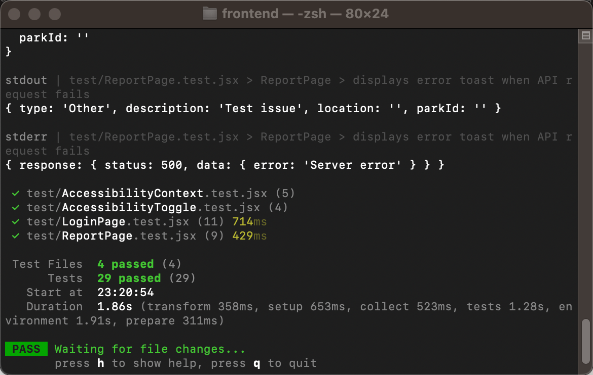

The OpenParks frontend prototype's testing plan is described in this document. The testing focuses on ensuring the core user flows function correctly and the accessibility features work as intended.

1.Unit Testing: 
Unit tests independently validate each component. The /test directory contains all of the tests.

1.1Test Files and Components: 
Four components were covered by the four test files that were produced:
The LoginPage component, including login/registration processes, form validation, authentication redirection, and error handling, is tested in LoginPage.test.jsx. includes 11 test cases.
The ReportPage component, including report submission, form validation, loading states, and API error handling, is tested in ReportPage.test.jsx. includes 9 test cases.
The AccessibilityContext, including high contrast mode state management and DOM class toggling, is tested in AccessibilityContext.test.jsx. includes 5 test cases.
AccessibilityToggle.test.jsx evaluates the accessibilityButton rendering, user interaction, and accessibility features are all toggleable. includes 4 test cases.

1.2Test Execution: 
Go to the frontend directory and run the following command to start the tests: 
npm test
The following screenshot shows the test results after running the command: 

The screenshot indicates that all 29 tests were successfully completed. The output confirms that all test files completed without errors.

2.Testing Environment: 
The tests were run in the following environment:
Testing Framework: Vitest v2.1.9
Testing Library: React Testing Library v16.0.0
Environment: jsdom (simulated browser)
Dependencies: React 19, React Router 7